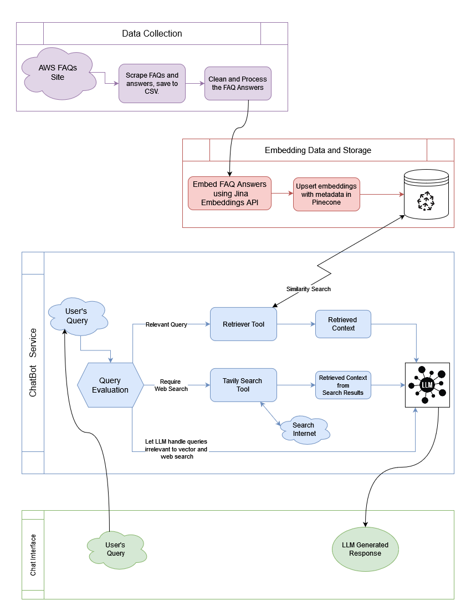

# AWSage: An Agentic Chatbot

## Chatbot Overview
AWSage is an agentic chatbot designed to streamline the handling of AWS Compute queries by leveraging a combination of generative AI, RAG (Retrieval-Augmented Generation), and LangChain technologies. This chatbot transforms traditional FAQ systems into a dynamic, interactive solution, capable of handling complex queries that span multiple AWS topics, providing precise and consolidated responses.

**Watch the detailed YouTube video walkthrough [here](https://youtu.be/95gRG43AcXg)** 
**Find the Project Report [here](report.pdf)**

## How this Chatbot Works

## Features
- **Dynamic FAQ Integration:** Converts static AWS FAQ content into an interactive chat interface.
- **Hybrid Query Handling:** Utilizes embedded knowledge and real-time internet search to answer a wide range of queries.
- **Smart Routing:** Efficiently directs questions to the most appropriate tool or model, optimizing response accuracy and speed.

## Project Structure
Follow these steps to set up and run the final chatbot:

### Installation:
1. Clone the repo.
2. Navigate to the project directory: `cd awsage`
3. Install the necessary libraries: `pip install -r requirements.txt`
4. Add the following required keys to your `.env` file:
    - `JINA_API_KEY` for [Jina Text Embeddings](https://jina.ai/embeddings/)
    - `PINECONE_API_KEY` for [Pinecone](https://www.pinecone.io/) Vector Store
    - `OPENAI_API_KEY` for [OpenAI](https://platform.openai.com/) LLM
    - `TAVILY_API_KEY` for [Tavily](https://app.tavily.com/sign-in) web search

### Project Components:
- **data-collection**
    - `scrapper.py`: Scrapes all the FAQs and their answers from the AWS website. These scrapped FAQs and answers will be stored in the CSV files.
- **vector-embeddings**
    - `embed.py`: Converts the scrapped FAQs and answers into embeddings and saves them into CSV files.
- **pinecone-data-upload**
    - `load-data.py`: Upserts the embeddings to Pinecone vector store.
- **chatbot**
    - `app.py`: The main entry point of the chatbot with a Streamlit interface.
    - `graph_service.py`: The LangGraph service that encompasses the Agentic Workflow with tools.

## Fine-Tuning

### Overview
For the fine-tuning of AWSage, we have utilized OpenAI's `gpt-4o-mini-2024-07-18` model. This process enhances the model's ability to generate responses that are tailored to the specific nuances and details found within the AWS FAQs.

### Prerequisites
**IMPORTANT**: You must have an OpenAI API key with full privileges for fine-tuning. Without the necessary permissions, the fine-tuning process will not execute correctly.

### Steps to Execute Fine-Tuning Job
1. **Prepare the Data**:
    - Run the script `fine_tuning/create_data.py` to convert the scraped AWS FAQ data into a format suitable for fine-tuning. This script ensures that the data aligns with the input expectations of OpenAI's fine-tuning process.

2. **Start the Fine-Tuning Job**:
    - Execute all cells within the `fine_tuning/fine_tuning.ipynb` notebook. This step initiates the fine-tuning job, which is then processed on OpenAI's servers. You can monitor the progress of this job through the OpenAI dashboard.

3. **Configure the Chatbot**:
    - Once the fine-tuning process is complete, update the `.env` file by setting `USE_FINE_TUNED_MODEL` to `TRUE`. This change instructs the chatbot to utilize the newly fine-tuned model for generating responses.

### Note on Fine-Tuning
Fine-tuning can be a time-intensive process, especially when dealing with large datasets or complex models. Ensure that you plan accordingly and monitor the process to address any issues that may arise during execution.

### Running the Application:
Execute the following command to run the chatbot: `streamlit run chatbot/app.py`

## Contact Information
For further inquiries or suggestions, please contact me at:
- Email: [satyapanthi.t@northeastern.edu](mailto:satyapanthi.t@northeastern.edu)
- LinkedIn: [tapaswi-v-s](https://www.linkedin.com/in/tapaswi-v-s/)

## License
This project is licensed under the MIT License - see the [LICENSE](LICENSE) file for details.